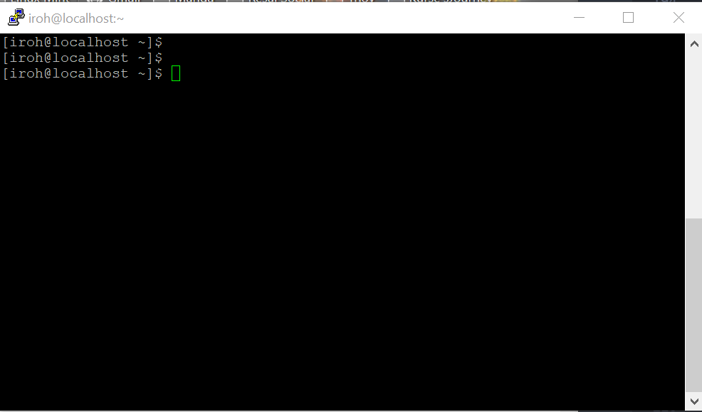

# TP 3 - Plusieurs réseaux : routage statique

## I. Utilisation simple d'une VM CentOS

---

### 5. Faire joujou avec quelques commandes

---

#### Ping

- Ping Hôte -> VM

```powershell
PS C:\Users\Irohn> ping 192.168.127.10

Envoi d’une requête 'Ping'  192.168.127.10 avec 32 octets de données :
Réponse de 192.168.127.10 : octets=32 temps<1ms TTL=64
Réponse de 192.168.127.10 : octets=32 temps<1ms TTL=64
Réponse de 192.168.127.10 : octets=32 temps<1ms TTL=64
```

- Ping VM -> Hôte

```bash
[iroh@localhost ~]$ ping 192.168.127.1
PING 192.168.127.1 (192.168.127.1) 56(84) bytes of data.
64 bytes from 192.168.127.1: icmp_seq=1 ttl=128 time=0.255 ms
64 bytes from 192.168.127.1: icmp_seq=2 ttl=128 time=0.590 ms
64 bytes from 192.168.127.1: icmp_seq=3 ttl=128 time=0.597 ms
64 bytes from 192.168.127.1: icmp_seq=4 ttl=128 time=0.656 ms
64 bytes from 192.168.127.1: icmp_seq=5 ttl=128 time=0.701 ms
64 bytes from 192.168.127.1: icmp_seq=6 ttl=128 time=0.650 ms
64 bytes from 192.168.127.1: icmp_seq=7 ttl=128 time=0.722 ms
64 bytes from 192.168.127.1: icmp_seq=8 ttl=128 time=0.670 ms
64 bytes from 192.168.127.1: icmp_seq=9 ttl=128 time=0.579 ms
64 bytes from 192.168.127.1: icmp_seq=10 ttl=128 time=0.716 ms
^C
--- 192.168.127.1 ping statistics ---
10 packets transmitted, 10 received, 0% packet loss, time 9017ms
rtt min/avg/max/mdev = 0.255/0.613/0.722/0.131 ms

```

---

#### Table de routage

- Table de routage Host

```powershell
PS C:\Users\Irohn> route print -4
===========================================================================
Liste d Interfaces
 17...0a 00 27 00 00 11 ......VirtualBox Host-Only Ethernet Adapter
  4...02 00 4c 4f 4f 50 ......Npcap Loopback Adapter
 64...0a 00 27 00 00 40 ......VirtualBox Host-Only Ethernet Adapter #2
 20...34 f3 9a f9 50 9d ......Microsoft Wi-Fi Direct Virtual Adapter
  7...36 f3 9a f9 50 9c ......Microsoft Wi-Fi Direct Virtual Adapter #2
 15...00 50 56 c0 00 01 ......VMware Virtual Ethernet Adapter for VMnet1
  5...00 50 56 c0 00 08 ......VMware Virtual Ethernet Adapter for VMnet8
 10...34 f3 9a f9 50 9c ......Intel(R) Dual Band Wireless-AC 8260
 21...34 f3 9a f9 50 a0 ......Bluetooth Device (Personal Area Network)
  1...........................Software Loopback Interface 1
===========================================================================

IPv4 Table de routage
===========================================================================
Itinéraires actifs :
Destination réseau    Masque réseau  Adr. passerelle   Adr. interface Métrique
          0.0.0.0          0.0.0.0      10.33.3.253        10.33.2.6     35
        10.33.0.0    255.255.252.0         On-link         10.33.2.6    291
        10.33.2.6  255.255.255.255         On-link         10.33.2.6    291
      10.33.3.255  255.255.255.255         On-link         10.33.2.6    291
        127.0.0.0        255.0.0.0         On-link         127.0.0.1    331
        127.0.0.1  255.255.255.255         On-link         127.0.0.1    331
  127.255.255.255  255.255.255.255         On-link         127.0.0.1    331
      169.254.0.0      255.255.0.0         On-link   169.254.185.209    281
  169.254.185.209  255.255.255.255         On-link   169.254.185.209    281
  169.254.255.255  255.255.255.255         On-link   169.254.185.209    281
     192.168.19.0    255.255.255.0         On-link      192.168.19.1    291
     192.168.19.1  255.255.255.255         On-link      192.168.19.1    291
   192.168.19.255  255.255.255.255         On-link      192.168.19.1    291
     192.168.47.0    255.255.255.0         On-link      192.168.47.1    291
     192.168.47.1  255.255.255.255         On-link      192.168.47.1    291
   192.168.47.255  255.255.255.255         On-link      192.168.47.1    291
     192.168.56.0    255.255.255.0         On-link      192.168.56.1    281
     192.168.56.1  255.255.255.255         On-link      192.168.56.1    281
   192.168.56.255  255.255.255.255         On-link      192.168.56.1    281
    192.168.127.0    255.255.255.0         On-link     192.168.127.1    281
    192.168.127.1  255.255.255.255         On-link     192.168.127.1    281
  192.168.127.255  255.255.255.255         On-link     192.168.127.1    281
        224.0.0.0        240.0.0.0         On-link         127.0.0.1    331
        224.0.0.0        240.0.0.0         On-link      192.168.56.1    281
        224.0.0.0        240.0.0.0         On-link         10.33.2.6    291
        224.0.0.0        240.0.0.0         On-link      192.168.47.1    291
        224.0.0.0        240.0.0.0         On-link   169.254.185.209    281
        224.0.0.0        240.0.0.0         On-link      192.168.19.1    291
        224.0.0.0        240.0.0.0         On-link     192.168.127.1    281
  255.255.255.255  255.255.255.255         On-link         127.0.0.1    331
  255.255.255.255  255.255.255.255         On-link      192.168.56.1    281
  255.255.255.255  255.255.255.255         On-link         10.33.2.6    291
  255.255.255.255  255.255.255.255         On-link      192.168.47.1    291
  255.255.255.255  255.255.255.255         On-link   169.254.185.209    281
  255.255.255.255  255.255.255.255         On-link      192.168.19.1    291
  255.255.255.255  255.255.255.255         On-link     192.168.127.1    281
===========================================================================
Itinéraires persistants :
  Aucun
```

- Table de routage VM

```bash
[iroh@localhost ~]$ ip route
default via 10.0.2.2 dev enp0s3 proto dhcp metric 100
10.0.2.0/24 dev enp0s3 proto kernel scope link src 10.0.2.15 metric 100
192.168.127.0/24 dev enp0s8 proto kernel scope link src 192.168.127.10 metric 101
```

- Ligne permettant la discussion

  - Sur l'hôte

  ```powershell
  192.168.127.0    255.255.255.0         On-link     192.168.127.1    281
  ```

  - Sur la VM

  ```bash
  192.168.127.0/24 dev enp0s8 proto kernel scope link src 192.168.127.10 metric 101
  ```

---

#### curl VM

```bash
[iroh@localhost ~]$ curl google.com
<HTML><HEAD><meta http-equiv="content-type" content="text/html;charset=utf-8">
<TITLE>301 Moved</TITLE></HEAD><BODY>
<H1>301 Moved</H1>
The document has moved
<A HREF="http://www.google.com/">here</A>.
</BODY></HTML>

```

---

#### dig VM

- ynov.com

  ```bash
  [iroh@localhost ~]$ dig ynov.com
  ;; SERVER: 10.33.10.20#53(10.33.10.20)
  ```

- google.com

  ```bash
  [iroh@localhost ~]$ curl google.com
  ;; SERVER: 10.33.10.20#53(10.33.10.20)
  ```

## II. Notions de ports et SSH

---

### 1.Exploration des ports locaux

- ss -4

  ```bash
  [iroh@localhost ssh]$ ss -4
  Netid State      Recv-Q Send-Q Local Address:Port                 Peer Address:Port
  tcp   ESTAB      0      64     192.168.127.10:ssh                  192.168.127.1:17951
  ```

- ss TCP

```bash
[iroh@localhost ~]$ ss -t
State       Recv-Q Send-Q Local Address:Port                 Peer Address:Port
ESTAB       0      64     192.168.127.10:ssh                  192.168.127.1:17951
```

- ss *listening*

```bash
[iroh@localhost ~]$ ss -l
Netid State      Recv-Q Send-Q Local Address:Port                 Peer Address:Port
tcp   LISTEN     0      128     *:ssh                   *:*
tcp   LISTEN     0      128    :::ssh                  :::*
```

- ss -n

```bash
[iroh@localhost ~]$ ss -n
Netid State      Recv-Q Send-Q Local Address:Port               Peer Address:Port
tcp   ESTAB      0      2432   192.168.127.10:22                 192.168.127.1:17951
```

- ss -p

```bash
[iroh@localhost ~]$ ss -p
Netid State      Recv-Q Send-Q Local Address:Port                 Peer Address:Port
tcp   ESTAB      0      0      192.168.127.10:ssh                  192.168.127.1:17951
```

### 2. SSH

---



### 3. Firewall

- A.SSH

-- Modification du port d'écoute

  J'ai modifié le fichier sshd_config en changeant le port par 2222.

  ```bash
  [iroh@localhost ssh]$ sudo cat sshd_config
  Port 2222
  #AddressFamily any
  #ListenAddress 0.0.0.0
  #ListenAddress ::
  ```

J'ai redémarré mon serveur ssh.

```bash
[iroh@localhost ssh]$ sudo ss -naltp4
State       Recv-Q Send-Q                                 Local Address:Port                                                Peer Address:Port
LISTEN      0      128                                                *:2222                                                           *:*                   users:(("sshd",pid=3807,fd=3))
LISTEN      0      100                                        127.0.0.1:25                                                             *:*                   users:(("master",pid=3379,fd=13))
```

La connexion échoue car on a changer le port d'écoute, il faut donc l'autoriser sur le firewall pour pouvoir réutliser le serveur ssh.

En autorisant la connexion on peut réutiliser notre serveur.

```bash
[iroh@localhost ~]$ sudo firewall-cmd --list-all
public (active)
  target: default
  icmp-block-inversion: no
  interfaces: enp0s3 enp0s8
  sources:
  services: ssh dhcpv6-client
  ports: 2222/tcp
  protocols:
  masquerade: no
  forward-ports:
  source-ports:
  icmp-blocks:
  rich rules:
```

---

- B. netcat